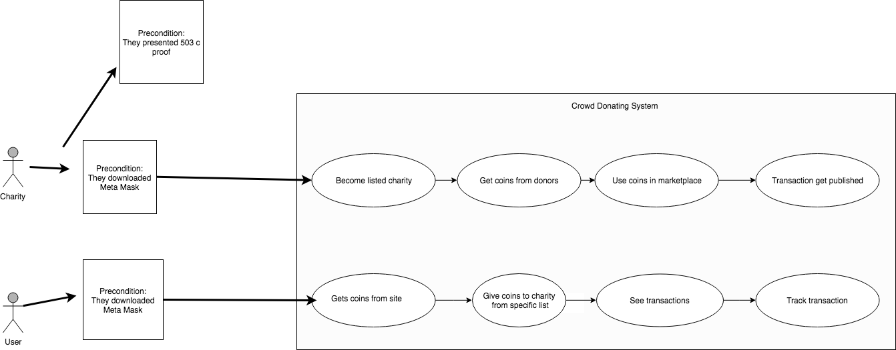

# Functional requirements
- **MVP (Stage 0)**: Users can register an account on our platform with an Ethereum address with Metamask Chrome plugin. Users will be awarded our ERC-20 token upon registration which they can donate to a dog charity. The platform will be deployed on an Ethereum Testnet so users will be able to verify that their donation went to the charity’s address.
- **Stage 1**: Instead of having the option to just donating to one dog charity, any charity will be able to create a page on our platform to receive donations.
- **Stage 2**: Integration with third-party services such as everiToken, uPort, and etc. to show to donor not only that their donation went to the intended recipient but also what the donation is being spent on.
- **Stage 3**: Make our coin easily mineable to the donor so anyone can participate in donation without owning any coin.
# Non-functional requirements
- **Privacy**: Donation recipient should have no knowledge of the donors except their public addresses
- **Constraints of development process**:
Development tools and frameworks for decentralized applications on Ethereum have not matured yet. With few active dApps and no industry standard to the development process discovered yet, it is difficult to plan how much of this project we can finish. Therefore, we split it into smaller stage milestones to ensure we will have a functional product at any stage.
## Potential performance goals:
- **Speed**: Ethereum supports up to 15 transactions per second, which will likely cause latency to our application
- **Reliability/Uptime**: As decentralized application technology is still very new, reliability and uptime cannot be quantified for now.
- **Data**: As data storage on the blockchain is expensive, we will aim to keep metadata stored on the blockchain for each transaction less than 1KB. Rest of the less important data can be stored on a NoSQL database cheaply.

# End-user Observation
## Persona 1

# Use cases UML

## Domain modeling

