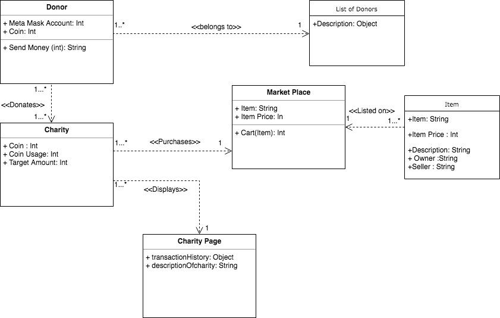

# Functional requirements
- **MVP (Stage 0)**: Users can register an account on our platform with an Ethereum address with Metamask Chrome plugin. Users will be awarded our ERC-20 token upon registration which they can donate to a dog charity. The platform will be deployed on an Ethereum Testnet so users will be able to verify that their donation went to the charity’s address.
- **Stage 1**: Instead of having the option to just donating to one dog charity, any charity will be able to create a page on our platform to receive donations.
- **Stage 2**: Integration with third-party services such as everiToken, uPort, and etc. to show to donor not only that their donation went to the intended recipient but also what the donation is being spent on.
- **Stage 3**: Make our coin easily mineable to the donor so anyone can participate in donation without owning any coin.
# Non-functional requirements
- **Privacy**: Donation recipient should have no knowledge of the donors except their public addresses
- **Constraints of development process**:
Development tools and frameworks for decentralized applications on Ethereum have not matured yet. With few active dApps and no industry standard to the development process discovered yet, it is difficult to plan how much of this project we can finish. Therefore, we split it into smaller stage milestones to ensure we will have a functional product at any stage.
## Potential performance goals:
- **Speed**: Ethereum supports up to 15 transactions per second, which will likely cause latency to our application
- **Reliability/Uptime**: As decentralized application technology is still very new, reliability and uptime cannot be quantified for now.
- **Data**: As data storage on the blockchain is expensive, we will aim to keep metadata stored on the blockchain for each transaction less than 1KB. Rest of the less important data can be stored on a NoSQL database cheaply.

# End-user Observation

## Persona 1 ##

- Catherine is a 20-years-old NYU sophomore majoring in Film and TV production. 3 years ago, she rescued a Yorkshire-terrier from a shelter. She then started to commit to some volunteer opportunities offered by some animal shelters in her community. 
Recently, her professor has assigned her a homework which requires her to work on it for 8 hours a day. As a result, she no long has time to devote to her volunteer works. She still wants to help more animals, but as a student, she does not have any income to donate to the organizations. Moreover, even if she is willing to donate, she is worried that the donation is not used wisely. Catherine does not trust most of the donation channel/platform because her dad works for UNICEF and told her that bribe is not a flaw, but a feature. Instead of skipping classes to volunteer or cutting the cost of living to buy food for the stray dog, she can now donate through Laika by simply register an account on Laika with and install Metamask Chrome plugin. Catherine does not need to be familiar with the technology in order to make a donation, and she is able to verify that the donation she made actually went to organization. She can now work hard on her assignments while still being able to help the animals in need by leaving a browser open. 

## Persona 2 ##

- Brooklyn Animal Action is an all-volunteer run rescue organization (not a shelter) in Brooklyn that rescue and rehome animal in need (mostly cats) in New York City. It has been active since 2010, and it has found home for over 4,000 cats (and a few dogs). Right now, the organization takes one-time or monthly donation on their website with the supervision of ActBlue to support their rescue work and help save lives. Furthermore, the donor can shop at their Amazon Wishlist to buy food for the animals. Since all the workers at the organizations are volunteers, BAA rely on the donations to continue rescuing animals in New York City. Although BAA is taking donations under the supervision of ActBlue Charities, a registered charitable organization formed to democratize charitable giving, it is still asking for donor to put down their credit card information or Paypal account. Many donors do not feel completely comfortable doing so, especially because they are unable to see where their money went. With Laika, the donors do not have to submit their private information online, making them more willing to donate to BAA.

# Use cases UML

## Domain modeling

